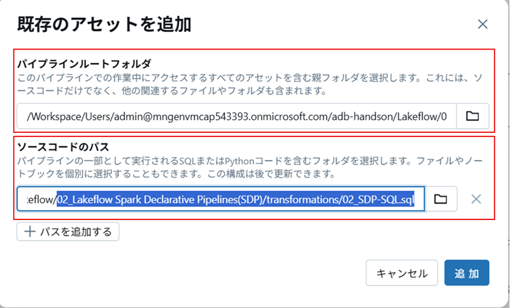
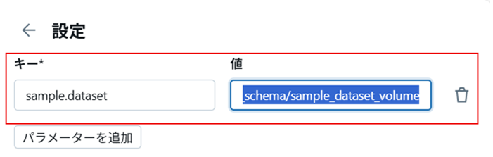
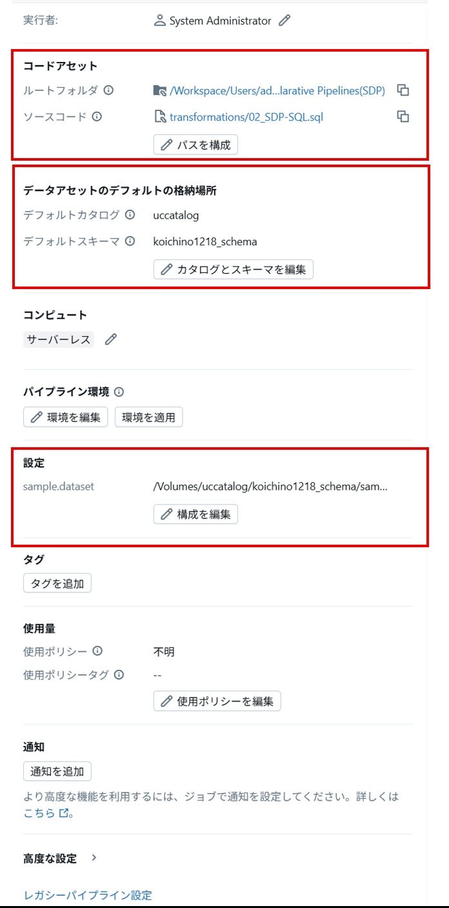
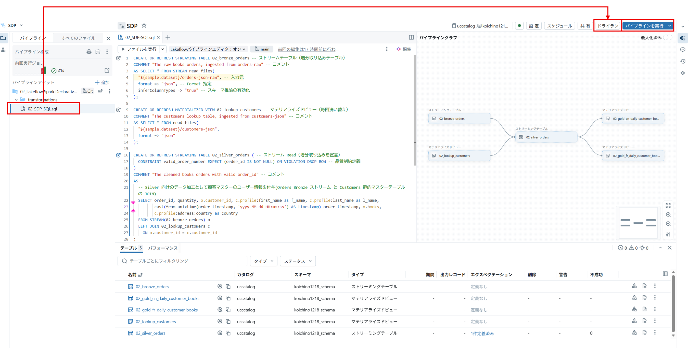

%md
# Lakeflow Spark 宣言型パイプライン （Spark Declarative Pipelines：SDP）
(旧称：Delta Live Tables（DLT））

## はじめに

このラボはノートブック内のセルを順次実行していくようなインタラクティブな形式ではなく、以下の「SDP パイプライン設定と実行」の手順に従って SDP ジョブを構成＆実行します。

利用する ER 図 は以下の通りです。

  

## SDP パイプライン設定
1. サイドバーの **ジョブとパイプライン** をクリックします。
1. **作成**をクリックし**ETLパイプライン**を選択します。
1. **パイプライン名**を入力します。名称は参加者全体で一意となるようあなたに固有の識別子を含めてください。(後述のラボへの影響のため、文字またはアンダースコア(_)から始まる名前とし、数字から始まる名前は避けます。)
1. 事務局から連絡のあった、カタログ名とスキーマ名を選択します。
1. **既存のアセットを追加**を選択します。
    1. パイプラインルートフォルダ で、ワークスペース内の**「02_Lakeflow Spark Declarative Pipelines(SDP)」**フォルダを選択します。
    1. ソースコードのパス で、上記フォルダー内の**「/transformations/02_SDP-SQL.sql」**ファイルを選択し、追加をクリックします。
 
   
1. 画面右上の**設定**をクリックします。
1. **設定**で`設定を追加`を押下し**キー**に `sample.dataset` を入力し **値**に `handson.h`で定義された `sample_dataset_path`のパス文字列 を入力し保存します。カタログメニューからもボリュームのパスを確認可能です。設定後、前のステップで設定した内容が正しくなっているか確認してください。
   
   
1. パイプラインフォルダー内のSQLファイルを選択すると、中央ペインにパイプラインのコードが表示されます。その後、**ドライラン** をクリックします。
1. エラーがない場合、パイプライングラフとテーブルが以下図のように出力されます。作成したパイプラインは、後述のLakeflow Jobsで呼び出し実行を行います。
   
