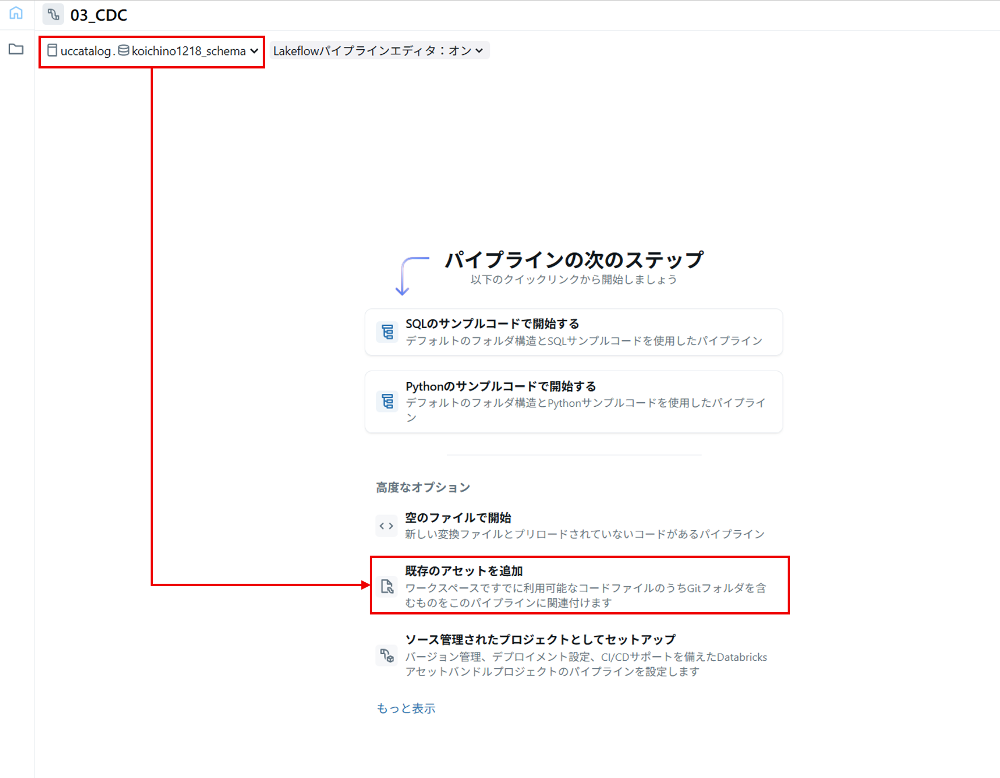
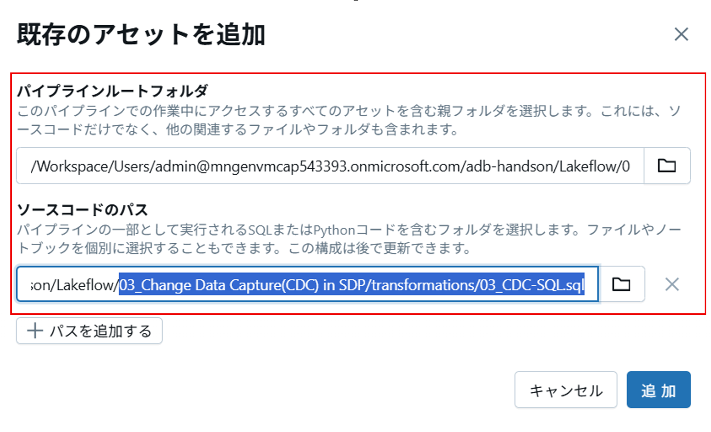
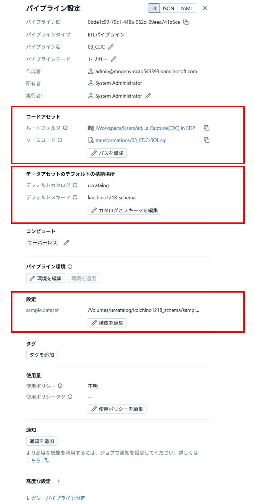
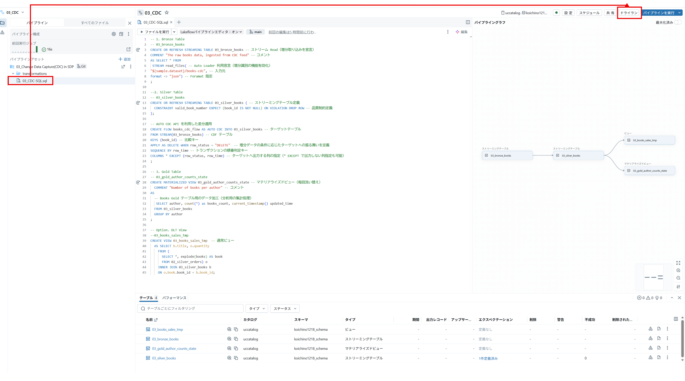

# Change Data Capture in SDP

## はじめに

このラボはノートブック内のセルを順次実行していくようなインタラクティブな形式ではなく、以下の「SDP パイプライン設定と実行」の手順に従って SDP ジョブを構成＆実行します。

このノートブックでは SDP における CDC ソースからの継続マージロードのサンプルコードを示します。

**CDC ソース**
| userid | name     | city        | operation | sequenceNum |
|--------|----------|-------------|-----------|-------------|
| 124    | Raul     | Oaxaca      | INSERT    | 1           |
| 123    | Isabel   | Monterrey   | INSERT    | 1           |
| 125    | Mercedes | Tijuana     | INSERT    | 2           |
| 126    | Lily     | Cancun      | INSERT    | 2           |
| 123    | null     | null        | DELETE    | 6           |
| 125    | Mercedes | Guadalajara | UPDATE    | 6           |
| 125    | Mercedes | Mexicali    | UPDATE    | 5           |
| 123    | Isabel   | Chihuahua   | UPDATE    | 5           |

**① SCD Type-1(更新履歴を表現しない) によるマージ**

**_SQL_**  
```SQL
CREATE OR REFRESH STREAMING TABLE target;

CREATE FLOW flow_name AS AUTO CDC INTO target
FROM stream(cdc_data.users)
KEYS (userId)
APPLY AS DELETE WHEN operation = "DELETE"
SEQUENCE BY sequenceNum
COLUMNS * EXCEPT (operation, sequenceNum)
STORED AS SCD TYPE 1;
```

**_結果_**
| userId | name     | city        |
|--------|----------|-------------|
| 124    | Raul     | Oaxaca      |
| 125    | Mercedes | Guadalajara |
| 126    | Lily     | Cancun      |

**② SCD Type-2(更新履歴を表現する) によるマージ**

**_SQL_** 
```SQL
CREATE OR REFRESH STREAMING TABLE target;

CREATE FLOW flow_name AS AUTO CDC INTO target
FROM stream(cdc_data.users)
KEYS (userId)
APPLY AS DELETE WHEN operation = "DELETE"
SEQUENCE BY sequenceNum
COLUMNS * EXCEPT (operation, sequenceNum)
STORED AS SCD TYPE 2;
```

**_結果_**
| userId | name     | city       | __START_AT | __END_AT |
|--------|----------|------------|------------|----------|
| 123    | Isabel   | Monterrey  | 1          | 5        |
| 123    | Isabel   | Chihuahua  | 5          | 6        |
| 124    | Raul     | Oaxaca     | 1          | null     |
| 125    | Mercedes | Tijuana    | 2          | 5        |
| 125    | Mercedes | Mexicali   | 5          | 6        |
| 125    | Mercedes | Guadalajara| 6          | null     |
| 126    | Lily     | Cancun     | 2          | null     |

**参考**
- [変更データ キャプチャ (CDC) とは](https://learn.microsoft.com/ja-jp/azure/databricks/ldp/what-is-change-data-capture)
- [AUTO CDC API: パイプラインを使用して変更データ キャプチャを簡略化する](https://learn.microsoft.com/ja-jp/azure/databricks/ldp/cdc)

それでは実際に試してみましょう。

## SDP パイプライン設定
1. サイドバーの **ジョブとパイプライン** をクリックします。
1. **作成**をクリックし**ETLパイプライン**を選択します。
1. **パイプライン名**を入力します。名称は参加者全体で一意となるようあなたに固有の識別子を含めてください。
1. 事務局から連絡のあった、カタログ名とスキーマ名を選択します。
1. **既存のアセットを追加**を選択します。
   1. **パイプラインルートフォルダ** で、ワークスペース内の**「03_Change Data Capture(CDC) in SDP」**フォルダを選択します。
   2. **ソースコードのパス** で、上記フォルダー内の**「/transformations/03_CDC-SQL.sql」**ファイルを選択し、追加をクリックします。
</br>
</br>  
1. 画面右上の**設定**をクリックします。
1. **設定**で`設定を追加`を押下し**キー**に `sample.dataset` を入力し **値**に `handson.h`で定義された `sample_dataset_path`のパス文字列 を入力し保存します。カタログメニューからもボリュームのパスを確認可能です。設定後、前のステップで設定した内容が正しくなっているか確認してください。
</br>  
</br>  
1. パイプラインフォルダー内のSQLファイルを選択すると、中央ペインにパイプラインのコードが表示されます。その後、**ドライラン** をクリックします。
1. エラーがない場合、パイプライングラフとテーブルが以下図のように出力されます。作成したパイプラインは、後述のLakeflow Jobsで呼び出し実行を行います。
</br>  