# アセットバンドル

## ハンズオンシナリオ
- 前のラボで作成したLakeflow 宣言的パイプラインとジョブをアセットバンドルを使用した管理について理解を深める。
  - アセットバンドル環境をローカルクライアントに用意する。
  - アセットバンドルプロジェクトを初期化する。
  - 既存のジョブ、パイプラインからアセットバンドル構成ファイルを生成する。
  - アセットバンドル構成ファイルをクライアント側で修正しワークスペースにデプロイする。
  - アセットバンドルコマンドを使用してジョブを実行する。

## 関連情報
- [Databricks アセット バンドルの開発](https://learn.microsoft.com/ja-jp/azure/databricks/dev-tools/bundles/work-tasks) 
- [Databricks アセット バンドルの構成](https://learn.microsoft.com/ja-jp/azure/databricks/dev-tools/bundles/settings)

## 前提条件
- Databricks CLI をローカルPCにインストール : ver 0.276.0 or later.
  - バージョン確認方法コマンド 
      - コマンド : `databricks -v` 
  - インストール方法については[こちらのURLから](https://learn.microsoft.com/ja-jp/azure/databricks/dev-tools/cli/install)
- ワークスペースファイルの有効化 (既定：有効)
  - [ワークスペースファイルについて](https://learn.microsoft.com/ja-jp/azure/databricks/files/workspace)
- Unity Catalog上の既存のカタログ
  - [カタログ作成について](https://learn.microsoft.com/ja-jp/azure/databricks/catalogs/create-catalog)

## オプション
 - ローカルパイプラインサポートPython モジュール - [宣言的パイプライン開発モジュール](https://pypi.org/project/databricks-dlt/) 

## 手順
1. 認証
    1. ローカル環境からワークスペースにログインする。
        - コマンド : `databricks auth login --host <workspace-url>`
        - workspace-url はご利用の環境の値に置換：例 - https://adb-xxxxxxxxxxxxxxxx.x.azuredatabricks.net
    2. Databricks CLI で入力した情報でローカル環境の[Azure Databricks 構成プロファイル](https://learn.microsoft.com/ja-jp/azure/databricks/dev-tools/auth/config-profiles)に保存される。
        - Unix、Linux、macOS: `~/.databrickscfg`
        - Windows: `%USERPROFILE%\.databrickscfg`
    3. 立ち上がった Web ブラウザー上で、Azure Databricksワークスペースにログインする。
    4. (オプション) 認証用のOAuthトークンの有効期限確認方法。同じHostのプロファイルが複数存在する場合は、---host と -p 両方を指定する。
        - `databricks auth token --host <workspace-url>`
        - `databricks auth token -p <profile-name>`
        - `databricks auth token --host <workspace-url> -p <profile-name>`

1. バンドルを作成する
    1. バンドルを作成するローカルディレクトリに移動する。
    1. 以下のコマンドを実行しバンドルを初期化
        - コマンド : `databricks bundle init`
        - **Using Workspace profile** : 認証時に作成したプロファイル名 (忘れた場合は、`.databrickscfg`ファイルを参照)
        - **Templace to use** : default-minimal
        - **project_name** : 任意のプロジェクト名
        - **Use a personal schema for each user working on this project.** : yes
        - **Initial language for this project:** : sql
    1. 全ての初期化構成が完了すると、以下のようなフォルダー構成でプロジェクトが作成されます。
        </br>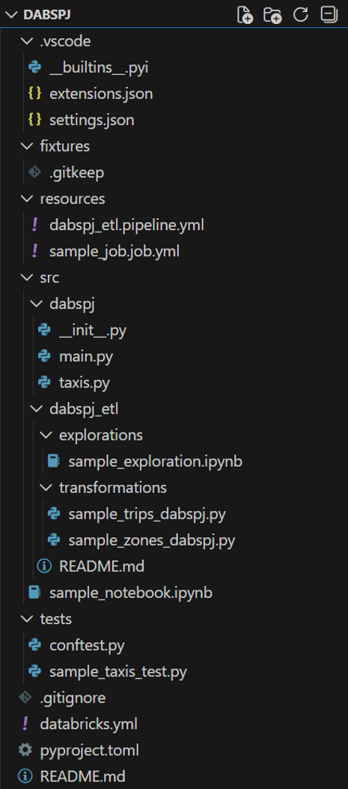

1. 既存のジョブ、パイプラインからバンドル構成ファイルを生成する
    1. ワークスペースの**ジョブとパイプライン**から、作成したジョブとパイプラインのIDをメモする。
        </br>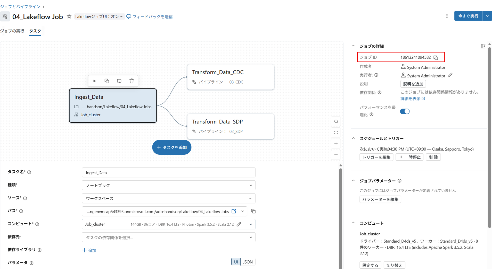
        </br>  

    1. ジョブ、パイプラインIDを使用し以下のコマンドで構成ファイルを生成する
        - コマンド：
            - ジョブ : `databricks bundle generate job --existing-job-id <Job ID>`
            - パイプライン : `databricks bundle generate pipeline --existing-pipeline-id <Pipeline ID>`
        
        - `resources`フォルダー内に、バンドル構成ファイル、`src`フォルダーに参照される成果物が作成されます。
            </br>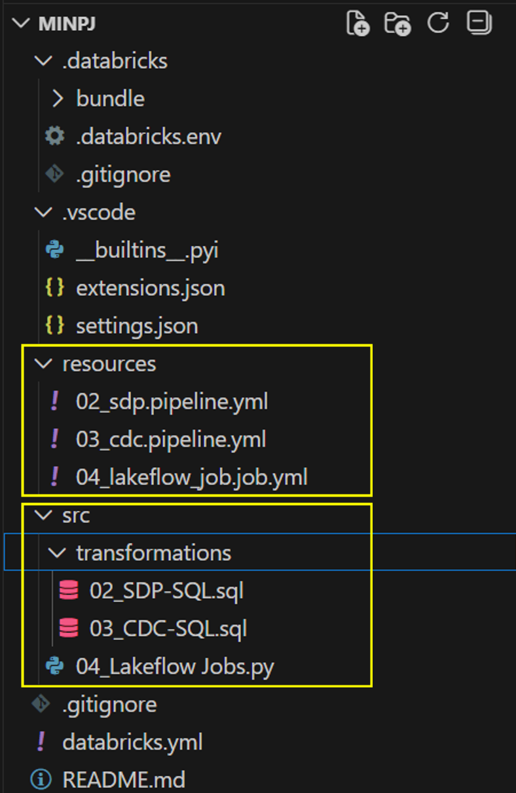

        - ワークスペースから `include/handson.h`をダウンロードし、解凍後に以下イメージのように、アセットバンドルルートに`include/handson.h.py`となるようにコピーする。(ジョブで実行されるNotebook上から `%run .././include/handson.h` の形でノートブックを外部実行に対応するの操作です。)
          - **※ワークスペース設定によりダウンロードができない場合は、[GitHub リポジトリ](https://github.com/koichino/adb-handson)からファイルをダウンロードして取得してください。`include/handson.h`の冒頭のセル内で定義された変数（`your_identifier`と`your_schema`）の値を本ハンズオンで使用する値に修正することを忘れないよう注意してください**


        </br>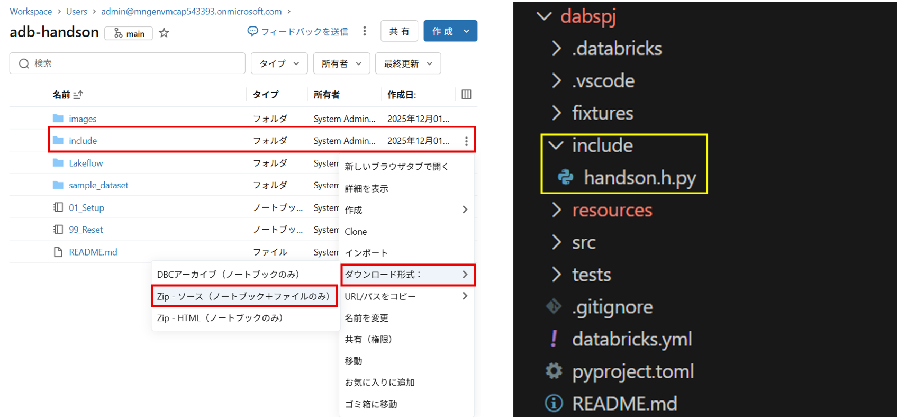

          
    1. バンドルしたプロジェクトファイルを修正しローカル環境からデプロイする。以下に修正サンプルを記載しますがご自由に変更を試してみてください。
        - 設定例：
            1. ジョブにスケジュールを設定する
                - `resources\04_lakeflow_job.job.yml` の末尾に以下のスニペットを追加する。(※ファイル名はLab_04で作成したジョブ名に依存します)
                  ```YAML
                  timeout_seconds: 0
                  schedule:
                    quartz_cron_expression: 51 30 16 * * ?
                    timezone_id: Asia/Tokyo
                    pause_status: UNPAUSED
                  webhook_notifications: {}
                  ```
            1. Taskの依存関係を変更する
                - `resources\04_lakeflow_job.job.yml` 以下のスニペットを追加する。(※ファイル名はLab_04で作成したジョブ名に依存します)
                  - depentson - task_key を変更する。 値はご自身で作成したタスク名(task_keyの値)を指定する。
                  ```YAML
                  Before:
                    - task_key: Transform_Data_CDC
                      depends_on:
                        - task_key: Ingest_Data
                      email_notifications: {}
                  ```
                  ```YAML
                  After:
                    - task_key: Transform_Data_CDC
                      depends_on:
                        - task_key: Transform_Data_SDP
                      email_notifications: {}
                  ```
            1. bandleとジョブの run_as パラメーターを追加する。
                - 参考 - バンドルのデプロイ、ジョブ/パイプラインの実行時に使用されるIDをユーザーと分離するための設定 
                  - [Databricks アセット バンドル ワークフローの実行 ID を指定する](https://learn.microsoft.com/en-us/azure/databricks/dev-tools/bundles/run-as))
                  - [Lakeflow ジョブの ID、アクセス許可、および特権を管理する](https://learn.microsoft.com/ja-jp/azure/databricks/jobs/privileges)
                - 前提
                    - 利用可能なサービスプリンシパルがユーザー管理されていること。(アカウントレベル、ワークスペースレベルのどちらのサービスプリンシパルでも可)
                    - 自分自身(コマンドを実行するユーザー)が、該当のサービスプリンシパルに対して、 'servicePrincipal.user'  権限が付与されていること 
                        </br>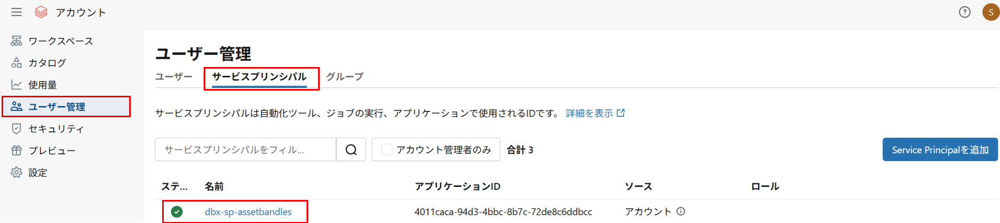  
                        </br>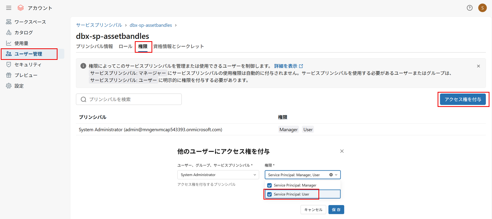  
                    - ジョブにrun asを設定する場合、該当サービスプリンシパルが処理実行中にアクセスするオブジェクト(カタログ/スキーマ/テーブルなど)に適切な権限があること
 
                - `databricks.yml` に以下のスニペットを追加する。
                  ```YAML
                  run_as:
                    service_principal_name: '<ユーザープリンシパルのuuid>'
                  ```
                - `resources\04_lakeflow_job.job.yml` 以下のスニペットを追加する。(※ファイル名はLab_04で作成したジョブ名に依存します)
                  ```YAML
                  run_as:
                    service_principal_name: '<ユーザープリンシパルのuuid>'
                  ```
        - 参考情報(利用できるパラメータ) 
          - [ジョブ](https://docs.databricks.com/api/azure/workspace/jobs/create#tasks-pipeline_task)
          - [パイプライン](https://docs.databricks.com/api/azure/workspace/pipelines/create)
        - Tips
            - ワークスペースで作成したオブジェクトからYAMLの設定方法を参照
                - 変更したいパラメーターをコピーし、バンドルファイルに貼り付ける。 
                  </br>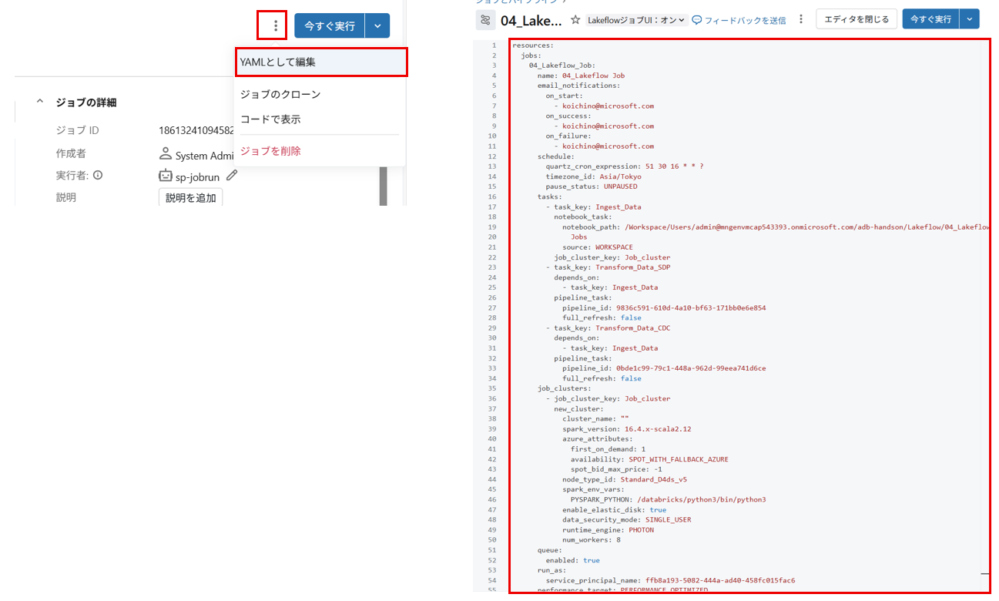
        - トラブルシューティング
          - ジョブ/パイプライン名は、文字かアンダースコア(_)で始まる必要がある。以前のLabでジョブとパイプライン名を数字から始まる名前で作成した場合以下のように修正が必要。
            </br>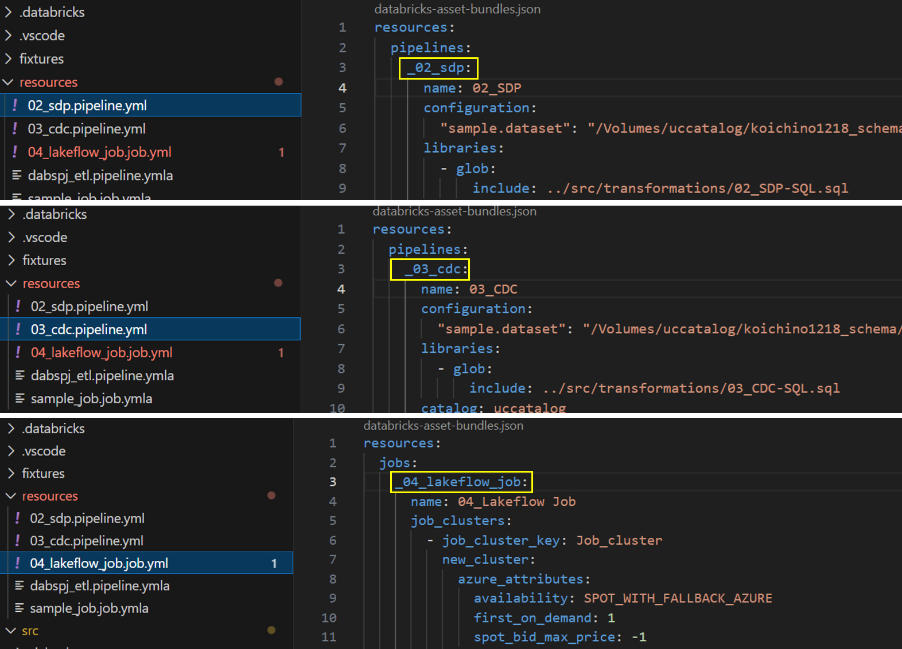

    1. バンドル構成を検証する
        1. 以下のコマンドを実行しバンドル構成を検証します。バンドル構成ファイルにエラーがないか検証します。
            - コマンド : `databricks bundle validate`
    1. バンドルをワークスペースにデプロイする
        1. バンドル ルートから Databricks CLI を使用して以下コマンドを実行します。(以下の例では、`databricks.yml`内のtarget=devを指定)
            - コマンド : `databricks bundle deploy --target dev`
        - トラブルシューティング：
            - ネットワークポリシーによりエラーが発生する場合以下のコマンドを実行します。
                - コマンド：`set DATABRICKS_BUNDLE_ENGINE=direct`
                - 参考：[直接デプロイ エンジンに移行する](https://learn.microsoft.com/ja-jp/azure/databricks/dev-tools/bundles/direct)
    1. デプロイが成功したら、デプロイ結果を確認します。
        1. バンドルからデプロイされたジョブとパイプラインにプレフィックスがついた状態でデプロイされます。(プレフィックスは開発モードの想定動作)
        </br>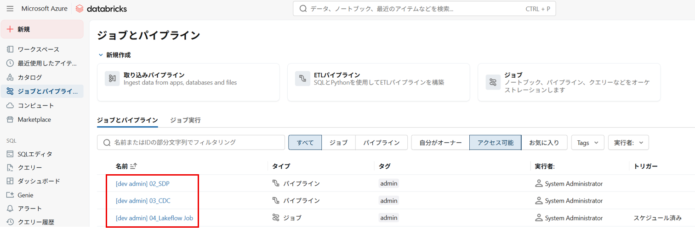
        1. 上記で修正したジョブを開きます。
            - アセットバンドルに接続されています。
            - タスクの依存関係の修正が反映されています。
            - スケジュール設定が反映されています。
              </br>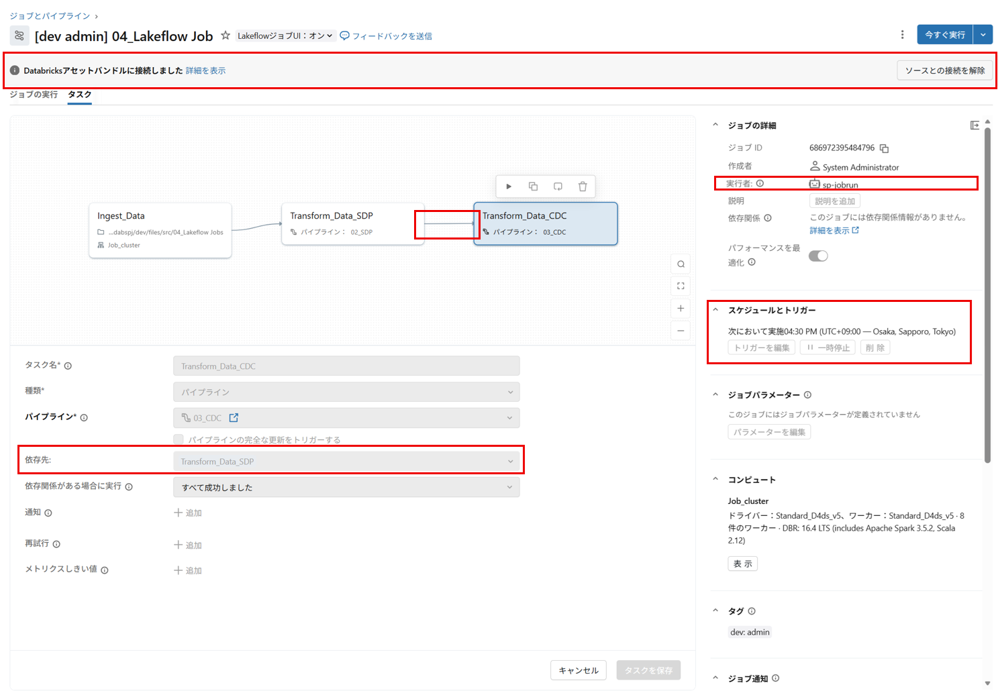
    1. バンドル ルートから以下のコマンドを実行しバンドルされたジョブを実行します。
        1. コマンド : `databricks bundle run --target dev <ジョブ名>` **※<ジョブ名>はYAMLで定義したジョブ名を指定します。**
          </br>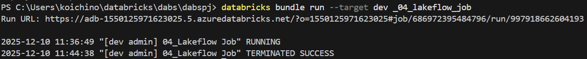
    1. **ジョブとパイプライン**から、ジョブが実行されたことを確認します。
    1. 全ての手順が完了したら以下のコマンドを実行しクリーンアップします。
        1. コマンド : `databricks bundle destroy --target dev`
        1. コマンド実行が完了したら、ワークスペースを確認します。
            - **ジョブとパイプライン**から、アセットバンドルでデプロイしたジョブとパイプラインが削除されていることを確認します。
            </br>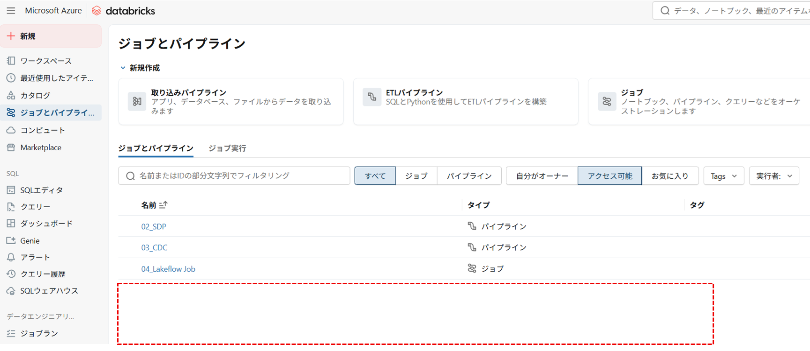
            - `<User>/.bandle`からデプロイされたリソースが削除されていることを確認します。必要に応じて、`.bandle`フォルダも削除してください。

以上でアセットバンドルのハンズオンラボは終了となります。お疲れ様でした。


